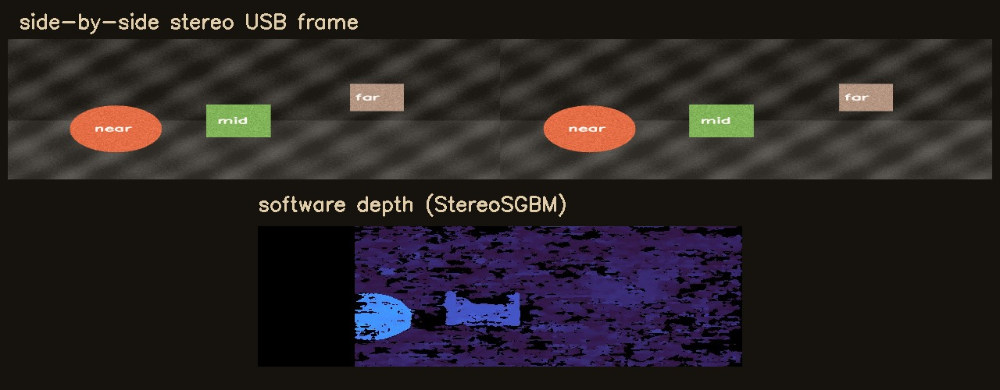
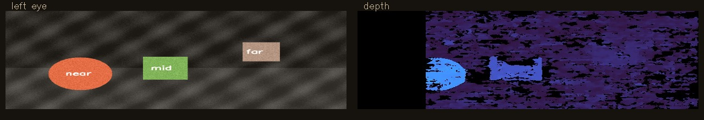

# Cheap USB stereo → depth camera for Viam

Turn a ~$40–90 dual-lens USB module into a Viam camera that serves **color, a depth preview, and a point cloud** — no RealSense, no Orbbec SDK, no proprietary driver.

These GXIVISION-style boards show up as a normal UVC webcam. One frame is **side-by-side stereo** (left | right). This project splits the eyes, runs OpenCV stereo matching, and exposes the result as a standard Viam camera component.

<p align="center">
  
</p>

<p align="center">
  
</p>

## Why this exists

Hardware depth cameras are great when you need them — and expensive, power-hungry, or awkward when you don’t. Dual-lens USB modules already ship synchronized stereo in one MJPEG stream. What’s missing is a small, boring bridge into a robot stack.

This repo is that bridge for [Viam](https://www.viam.com): plug in the camera, open Chrome, stream, and you get `GetImages` + `GetPointCloud` like any other depth camera.

## What you get

| Resource | What it is |
|---|---|
| `cam` | Custom module: color JPEG + depth colormap + PCD |
| `cam-left` / `cam-right` | Built-in Viam `transform` crops of each eye |

```text
USB dual-lens module
        │  side-by-side MJPEG (e.g. 2560×720)
        ▼
   Chrome (WebRTC)  ──►  Python module  ──►  viam-server
                              │
                     StereoSGBM depth + PCD
```

WebRTC is intentional: on macOS especially, browser camera access is more reliable than fighting host permissions for every process.

## Hardware

Any UVC dual-lens module that outputs a **side-by-side** frame works. Tested pattern:

- **GXIVISION** (and clones): MJPEG `2560×720@30`, synchronized left/right in one USB device
- ~60 mm baseline (many boards are adjustable)
- Wide / fisheye lenses are common — depth is approximate until you calibrate

Search terms that find them: `dual lens USB camera 2560x720`, `3D stereo USB module synchronized`.

## Quick start

### 1. Viam machine

1. Create a machine at [app.viam.com](https://app.viam.com).
2. **CONFIGURE → JSON** → paste [`configs/single-camera.json`](configs/single-camera.json) → save.
3. Download the private machine credentials and save as `local/viam.json` (gitignored).

### 2. Run

```sh
docker compose up --build
```

### 3. Stream from the browser

1. Open [http://localhost:8081](http://localhost:8081) in Chrome.
2. **Enable camera access** → pick the stereo module.
3. Optional: **Rotate 180°** if the mount is upside down.
4. **Start streaming** and leave the tab open.

### 4. Check it

- Viam **CONTROL** tab → `cam`, then `cam-left` / `cam-right`
- Bridge heartbeat: [http://localhost:8081/api/status](http://localhost:8081/api/status)

## Try the depth math without a camera

```sh
uv sync --extra bridge
uv run python -m unittest discover -s tests -v
```

The unit tests synthesize a stereo pair and assert a valid PCD + JPEG depth preview.

## How depth is computed

1. Decode the latest side-by-side JPEG from the WebRTC frame store.
2. Split left/right halves.
3. Downscale and run `cv2.StereoSGBM`.
4. Publish a turbo colormap as a second named image (`cam-depth`).
5. Reproject disparities with configurable `focal_px` and `baseline_mm` into ASCII PCD.

This is **software stereo**, not a time-of-flight or structured-light sensor. Expect useful near-field obstacle cues around roughly 2–4 m; farther out gets noisy, especially with wide fisheye lenses and no calibration.

### Module attributes

| Attribute | Default | Meaning |
|---|---|---|
| `stream_id` | required | Must match the browser stream (`cam`) |
| `focal_px` | `700` | Approximate focal length for PCD |
| `baseline_mm` | `60` | Stereo baseline in millimeters |

## Local development (no Docker UI)

```sh
uv sync --extra bridge
uv run --extra bridge stereo-depth-web   # http://localhost:8081
```

Static UI only (no WebRTC to Viam):

```sh
uv run python -m http.server 8081 --bind 127.0.0.1 \
  --directory src/stereo_depth/web
```

## Project layout

```text
src/stereo_depth/
  bridge/          # Viam module + WebRTC server + stereo math
  web/             # Single-camera setup UI
configs/           # Paste-ready Viam machine JSON
docs/assets/       # Demo images
```

## Honest limitations

- No fisheye rectification yet — disparity quality depends on roughly aligned eyes.
- Depth preview is a colormap JPEG, not a raw depth MIME type.
- Browser must stay open while streaming (WebRTC ingress).
- Not a replacement for calibrated industrial stereo or RealSense accuracy.

## Related

Built as a single-module slice of a larger multi-camera 360 stereo experiment. One camera first; ring fusion later if you need it.

## License

MIT — see [LICENSE](LICENSE).
